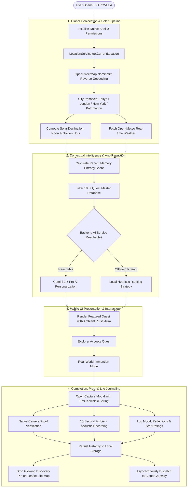
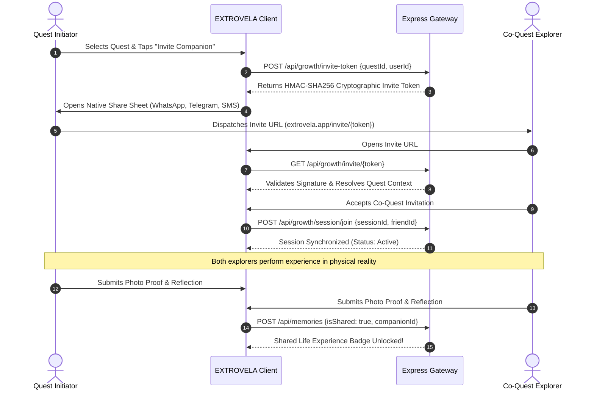

# EXTROVELA: Real-World Experience Engine & Open-World Life Platform

<div align="center">
  
  <h2>Stop scrolling. Start experiencing.</h2>
  <p><em>Don't just get through your day. Make today different.</em></p>

  <p>
    <a href="#table-of-contents">Table of Contents</a> •
    <a href="#system-architecture">Architecture</a> •
    <a href="#core-experience-loop">Core Loop</a> •
    <a href="#feature-encyclopedia">Feature Map</a> •
    <a href="#api-reference">API Reference</a> •
    <a href="#database-architecture">Database</a> •
    <a href="#developer-guide">Developer Guide</a> •
    <a href="#security-and-privacy">Security</a>
  </p>
</div>

================================================================================
TABLE OF CONTENTS
================================================================================

1. EXECUTIVE SUMMARY AND PRODUCT VISION
2. PROBLEM STATEMENT AND PSYCHOLOGICAL FOUNDATIONS
3. THE EXTROVELA CORE EXPERIENCE LOOP
4. SYSTEM ARCHITECTURE AND HIGH-LEVEL DESIGN
5. INTERACTIVE FLOWCHARTS AND STATE DIAGRAMS
6. REPOSITORY FILE CATALOG AND DIRECTORY TREE
7. FEATURE ENCYCLOPEDIA AND CAPABILITIES
8. ASTRONOMICAL SOLAR AND CELESTIAL PHYSICS ENGINE
9. WEATHER-ADAPTIVE CONTEXTUAL ENGINE
10. PROCEDURAL AMBIENT AUDIO SYNTHESIS ENGINE
11. HARDWARE MEDIA CAPTURE AND 9:16 CANVAS STORY EXPORTER
12. GEOLOCATION, REVERSE GEOCODING, AND PRIVACY ENGINE
13. LEAFLET LIFE MAP AND DISCOVERY GRID SYSTEM
14. ANTI-REPETITION AND CATEGORY ENTROPY ALGORITHM
15. CO-QUESTS, CRYPTOGRAPHIC INVITES, AND SOCIAL LOOPS
16. EMIL KOWALSKI AND APPLE SPRING MOTION DESIGN SYSTEM
17. GLASSMORPHIC ALERT AND TOAST SYSTEM
18. COMPLETE REST API SPECIFICATION
19. MONGODB AND FIRESTORE DATABASE MODELS
20. SECURITY RULES AND PERMISSION MATRICES
21. OFFLINE-FIRST SYNCHRONIZATION PROTOCOL
22. DEVELOPER ONBOARDING AND ENVIRONMENT CONFIGURATION
23. CAPACITOR NATIVE MOBILE COMPILATION GUIDE
24. COMPLETE FOURTEEN PHASE ENGINEERING HISTORY
25. PRE-PUSH DEFENSIVE SECURITY AUDIT REPORT
26. DOCUMENTATION SITEMAP AND REPOSITORY INDEX
27. LICENSE AND CREDITS

================================================================================
1. EXECUTIVE SUMMARY AND PRODUCT VISION
================================================================================

EXTROVELA is a cross-platform mobile and web application engineered to solve the pervasive modern crisis of routine paralysis, digital screen fatigue, and urban loneliness. In contemporary society, people spend upwards of eight to twelve hours per day looking at computer screens and smartphones, consuming passive algorithmic entertainment that leaves them feeling isolated and unfulfilled.

Even when people feel an active desire to step outside, explore their surrounding city, or experience something novel, they are frequently paralyzed by decision fatigue. Traditional discovery tools like Yelp, TripAdvisor, or Google Maps are designed for consumer commerce and tourism rather than intentional personal living; they present overwhelming lists of commercial venues without context, encouragement, or narrative meaning.

EXTROVELA is built on a fundamentally different philosophy:
1. It is an anti-screen application. Every screen interaction is designed to push the user into the real, physical world within two minutes of opening the app.
2. It treats the physical world as an open-world exploration game. Every completed real-world experience illuminates territory on a personal Life Map, creating a tangible visual chronicle of a life lived.
3. It personalizes invitations dynamically based on time availability (15 minutes to 60+ minutes), physical energy level, current mood, budget, real-time outdoor weather, and astronomical solar timing.
4. It operates without commercial pressure, dark patterns, endless social feeds, or infinite doom-scrolling mechanisms.

================================================================================
2. PROBLEM STATEMENT AND PSYCHOLOGICAL FOUNDATIONS
================================================================================

The architecture of EXTROVELA is grounded in three core psychological and behavioural frameworks:

1. THE PARADOX OF CHOICE AND DECISION FATIGUE
When individuals finish a workday or weekend morning with unstructured free time, having infinite possible activities causes cognitive friction. Rather than deciding between hundreds of options, people default to high-dopamine, low-effort passive screen consumption. EXTROVELA eliminates decision fatigue by offering exactly one curated "Today's Quest" with three personalized alternatives tailored to the user's immediate state.

2. BEHAVIOURAL ACTIVATION AND ROUTINE DISRUPTION
Psychological research in behavioural activation demonstrates that engaging in small, structured physical activities directly alleviates depressive inertia and feelings of stagnation. EXTROVELA structures real-world quests into low-friction, micro-adventures (e.g., 15-minute sky watching, silent book reading in a neighborhood teahouse, noticing five architectural details on a familiar street) that require minimal prep but deliver high emotional payoff.

3. THE POWER OF EPISODIC MEMORY ANCHORING
Routine days blend together in human memory because the brain filters out repetitive stimuli. When someone does something novel—even as simple as getting off a bus at a random stop or watching sunset from an unfamiliar hill—the hippocampus records distinct episodic memory anchors. EXTROVELA captures these anchors through multimodal reflection: verified proof photos, 15-second ambient sound recordings, mood delta scores, and personal reflections.

================================================================================
3. THE EXTROVELA CORE EXPERIENCE LOOP
================================================================================

The entire application operates around a seamless six-stage cyclical loop:

STAGE 1: CONTEXT INITIALIZATION
The client device wakes up, resolves geographic coordinates, performs reverse geocoding to identify the local municipality, calculates solar sunset declination, and samples atmospheric conditions.

STAGE 2: INTENT SELECTION OR "I'M BORED" INSTANT SPIN
The explorer declares their constraints:
• Available Time: 15 Minutes (Micro), 30 Minutes (Standard), 45 Minutes (Extended), or 60+ Minutes (Deep Immersion)
• Energy Level: Low (Calm/Observational), Medium (Active Walk), or High (Physical/Social)
• Emotional State: Seeking Peace, Seeking Inspiration, Feeling Stuck, or Seeking Connection
• Budget: Free ($0), Inexpensive ($), or Moderate ($$)
Alternatively, tapping the "I'm Bored" Quick Escape triggers an interactive physics wheel that instantly picks an achievable 15-minute micro-quest.

STAGE 3: REAL-WORLD EXECUTION (PHONE-FREE IMMERSION)
The user locks their phone or enables Phone-Free Mode. The app provides clear instructions, ambient background audio synthesizers if requested, and runs a gentle timer. The user completes the experience in physical reality.

STAGE 4: MULTIMODAL PROOF AND REFLECTION CAPTURE
Upon completion, the user launches the Capture Modal:
• Proof Photo: Snapped directly via native camera hardware or uploaded.
• 15-Second Ambient Voice Note: Records environmental acoustics (bird calls, rain, city hum, fountain water).
• Reflection Journaling: Captures feelings, insights, and lessons.
• Quantitative Scores: 1–5 Star Rating and 1–5 Mood Transformation Delta.

STAGE 5: LIFE MAP ILLUMINATION AND REPUTATION
The memory is committed to the local database and synchronized to the cloud. A glowing discovery pin drops onto the Leaflet Life Map, fog over the neighborhood dissolves, and the user's city exploration percentage increments.

STAGE 6: SOCIAL SHARING AND CO-QUEST INVITATION
The explorer can export a branded 9:16 full-bleed Instagram/TikTok story card or generate a cryptographic invite token to embark on their next adventure with a companion.

================================================================================
4. SYSTEM ARCHITECTURE AND HIGH-LEVEL DESIGN
================================================================================

EXTROVELA utilizes a multi-tiered, decoupled client-server architecture designed for high availability, zero-latency offline operation, and strict user privacy:

```
+=============================================================================+
|                       EXTROVELA MOBILE & WEB CLIENT                         |
|                                                                             |
|  +----------------+  +----------------+  +----------------+  +-----------+  |
|  |   HomeScreen   |  | ExploreScreen  |  |   MapScreen    |  | Memories  |  |
|  | (Quests/Hero)  |  |  (180+ Quests) |  | (Leaflet World)|  | (Journal) |  |
|  +--------+-------+  +--------+-------+  +--------+-------+  +-----+-----+  |
|           |                   |                   |                |        |
|           +-------------------+---------+---------+----------------+        |
|                                         |                                   |
|                                         v                                   |
|                   GLOBAL REACT CONTEXT ORCHESTRATION LAYER                  |
|          (AppStateContext, AuthContext, CustomAlertContext)                 |
|                                         |                                   |
|                  +----------------------+----------------------+            |
|                  |                                             |            |
|                  v                                             v            |
|        CAPACITOR NATIVE BRIDGE                      OFFLINE-FIRST STORAGE   |
|     (Camera, GPS, Audio, Haptics)                 (IndexedDB & LocalQueue)  |
+==================+=============================================+============+
                   |                                             |
                   | REST HTTPS API                              | Sync Queue
                   v                                             v
+=============================================================================+
|                       EXTROVELA EXPRESS API GATEWAY                         |
|                                                                             |
|  +-----------------------------------------------------------------------+  |
|  |                            ROUTER LAYER                               |  |
|  |   /api/quests       /api/memories    /api/stats     /api/intelligence |  |
|  |   /api/providers    /api/growth      /api/admin     /api/health       |  |
|  +-----------------------------------------------------------------------+  |
|         |                            |                          |           |
|         v                            v                          v           |
|  costProtection             requireIdentity              requireAdmin       |
|    Middleware                  Middleware                 Middleware        |
+=========+============================+==========================+===========+
          |                            |                          |
          v                            v                          v
+===================+        +====================+     +=====================+
|   MONGODB ATLAS   |        |  FIREBASE SERVICES |     | EXTERNAL PROVIDERS  |
| (Quests, Stories, |        | (Auth, Storage,    |     | (OpenStreetMap,     |
|  Users, Analytics)|        |  Performance SDK)  |     |  Open-Meteo API)    |
+===================+        +====================+     +=====================+
```

================================================================================
5. INTERACTIVE FLOWCHARTS AND STATE DIAGRAMS
================================================================================





================================================================================
6. REPOSITORY FILE CATALOG AND DIRECTORY TREE
================================================================================

```
Extrovela/
├── android/                         Capacitor native Android project and Gradle build files
├── ios/                             Capacitor native iOS project and Xcode workspace
├── docs/                            Comprehensive architectural specifications and audits
│   ├── ARCHITECTURE.md              Technical architecture and engineering guidelines
│   ├── BACKEND.md                   Express.js backend gateway and MongoDB schemas
│   ├── COST_CONTROL.md              AI token budgets and rate-limiting policies
│   ├── ENVIRONMENT.md               Environment variables and runtime configuration
│   ├── FIREBASE_SETUP.md            Firebase Auth, Storage, and Analytics setup
│   ├── FIRESTORE_SCHEMA.md          Cloud Firestore collection schema definitions
│   ├── MASTER_INTEGRATION_AUDIT.md  21-area architectural audit and verification matrix
│   ├── PHASE_11_REPORT.md           Experience Intelligence and AI personalization
│   ├── PHASE_12_REPORT.md           Growth loops, invite tokens, and co-quests
│   └── SECURITY.md                  Security policies, location privacy, and defenses
├── public/                          Static assets, brand emblems, and web manifest
│   ├── logo-light.png               Light mode high-resolution brand logo
│   ├── logo-dark.png                Dark mode high-contrast brand emblem
│   └── favicon.ico                  Application icon
├── server/                          Node.js & Express API Gateway
│   ├── middleware/
│   │   ├── costProtection.js        AI rate-limiting and cost safety middleware
│   │   ├── requireAdmin.js          Administrative authorization guard
│   │   └── requireIdentity.js       Client identity verification guard
│   ├── models/
│   │   ├── Memory.js                Mongoose model for completed experience stories
│   │   ├── Quest.js                 Mongoose model for curated quest definitions
│   │   └── User.js                  Mongoose model for user accounts and statistics
│   ├── routes/
│   │   ├── admin.js                 Administrative metrics and control endpoints
│   │   ├── api.js                   Core quest, memory, and stats API routes
│   │   ├── growth.js                Cryptographic invite and co-quest routes
│   │   ├── intelligence.js          AI quest generation proxy routes
│   │   └── providers.js             Weather and reverse-geocoding provider routes
│   ├── server.js                    Express application bootstrap and CORS allowlist
│   └── .env.example                 Template for server environment variables
├── src/                             React 18 Frontend Application
│   ├── components/                  Reusable UI components and views
│   │   ├── primitives/              Atomic design tokens (Button, Card, Badge, Modal, Text)
│   │   ├── screens/                 Primary application screens
│   │   │   ├── HomeScreen.tsx       Dynamic greeting, featured quest, quick escapes
│   │   │   ├── ExploreScreen.tsx    Categorized directory of 180+ curated quests
│   │   │   ├── MapScreen.tsx        Interactive Leaflet exploration world and pins
│   │   │   ├── MemoriesScreen.tsx   Journal timeline, smart recaps, and collections
│   │   │   └── ProfileScreen.tsx    User statistics, account linking, cache, deletion
│   │   ├── AdminMetricsModal.tsx    Real-time platform observability dialog
│   │   ├── CaptureModal.tsx         Camera proof, audio note, and reflection form
│   │   ├── Navbar.tsx               Spring-animated navigation bar with active dot
│   │   ├── QuestSpinnerModal.tsx    Physics-driven "I'm Bored" quick action wheel
│   │   ├── ShareStoryModal.tsx      9:16 Canvas story card generator for TikTok/IG
│   │   ├── SoundscapeDrawer.tsx     Web Audio procedural nature ambiance synthesizer
│   │   └── VoiceRecorder.tsx        15-second ambient acoustic recording component
│   ├── config/                      Runtime configuration and feature toggles
│   ├── constants/                   Mock data, quest database, and design constants
│   ├── context/                     React Context state orchestration
│   │   ├── AppStateContext.tsx      Global state, GPS resolver, quest persistence
│   │   ├── AuthContext.tsx          Local session state and Firebase Authentication
│   │   └── CustomAlertContext.tsx   Glassmorphic alert, confirm, and toast system
│   ├── features/                    Domain-sliced modular feature packages
│   ├── lib/                         Core computational and native utilities
│   │   ├── ai-quest-engine.ts       Astronomical solar calculations and AI synthesis
│   │   ├── api.ts                   Sanitized HTTP client for backend gateway
│   │   └── native-device.ts         Capacitor camera, geolocation, and haptic bridge
│   ├── quest-engine/                Quest scoring, ranking, and candidate generation
│   ├── services/                    Service layer integrations
│   │   ├── context/                 LocationService and OpenStreetMap geocoder
│   │   ├── firebase/                Firebase SDK configuration and performance telemetry
│   │   └── intelligence/            Anti-repetition and experience diversity engines
│   ├── styles/
│   │   └── index.css                Pure Vanilla CSS design system and spring tokens
│   ├── types/                       TypeScript domain type contracts
│   └── utils/                       Error handlers, haptic triggers, privacy loggers
├── capacitor.config.json            Native Capacitor configuration
├── firestore.rules                  Cloud Firestore declarative security rules
├── storage.rules                    Firebase Cloud Storage access control rules
└── vite.config.ts                   Vite bundler configuration
```

================================================================================
7. FEATURE ENCYCLOPEDIA AND CAPABILITIES
================================================================================

1. TODAY'S CURATED FEATURED QUEST
Every morning at 06:00 local time, EXTROVELA calculates the optimal quest for the user based on day of the week, local weather forecast, time availability, and past history. The featured card glows with an ambient breathing aura and displays time and budget tags.

2. EXPLORE DIRECTORY (180+ REAL-WORLD EXPERIENCES)
A searchable, categorized catalog spanning five core life dimensions:
• Explore: Neighborhood discovery, hidden alleys, architectural observation, new transit lines.
• Nature: Cloud watching, botanical garden visits, hilltop vistas, star viewing, park walks.
• Create: Sketching physical scenes, writing letters to future self, photography challenges.
• Connect: Authentic compliment exchanges, striking conversations with baristas, shared tea.
• Reflect: Journaling in quiet sanctuaries, phone-free coffee meditation, cemetery history walks.

3. "I'M BORED" MICRO-ADVENTURE SPINNER WHEEL
When an explorer has only 15–20 minutes and zero energy for planning, tapping the Small Escape card opens a canvas-rendered spinning wheel that randomly awards an instant, achievable micro-quest.

4. PROCEDURAL AMBIENT NATURE SOUNDSCAPES
An integrated Web Audio synthesizer provides background ambiance during quest execution:
• Summer Rain: Soft droplet impacts and low-frequency rumble.
• Forest Canopy: High-frequency randomized birdsong pings and gentle rustling.
• Ocean Shore: Low-frequency oscillator wave swells.
• Highland Wind: Bandpass swept filtered noise.

5. 15-SECOND AMBIENT VOICE RECORDER
Alongside camera photos, users can record a 15-second acoustic snapshot of their surroundings using native MediaRecorder APIs, capturing church bells, rain on rooftops, river rapids, or bustling coffeehouse murmurs.

6. 9:16 SOCIAL STORY CANVAS EXPORTER
Completed quests can be transformed into full-bleed 1080x1920 Instagram Stories or TikTok posts with high-contrast typography, location stamps, quotes, and gradient overlays with one-tap Web Share API support.

7. INTERACTIVE LEAFLET LIFE MAP
Every completed experience places an illuminated memory pin on the explorer's world map. Unexplored city districts are veiled in atmospheric fog that dissolves as the user visits new coordinates.

8. ANTI-REPETITION AND RECOVERY ENGINE
If an explorer completes multiple consecutive indoor or solitary quests, the system calculates category entropy and automatically nudges the user toward an outdoor sunset walk or social challenge.

9. CRYPTOGRAPHIC CO-QUEST INVITES
Users can invite friends or meet companions by sharing a secure HMAC-SHA256 signed URL. Both participants receive synchronized progress updates and dual-completion badges.

10. GLASSMORPHIC ALERT AND TOAST SYSTEM
Zero native browser alert popups. All confirmations, warnings, and toasts render through an animated, haptic-enabled custom dialog system.

================================================================================
8. ASTRONOMICAL SOLAR AND CELESTIAL PHYSICS ENGINE
================================================================================

EXTROVELA implements exact astronomical solar positioning algorithms in `src/lib/ai-quest-engine.ts` to schedule golden-hour experiences with zero API overhead:

1. SOLAR DECLINATION FORMULA
The angular distance of the Sun north or south of the Earth's celestial equator is approximated using Spencer's formula:

$$\delta = 23.45^\circ \cdot \sin\left(\frac{284 + n}{365} \cdot 360^\circ\right)$$

Where $n$ represents the day number of the current calendar year (1 to 365).

2. HOUR ANGLE CALCULATION
The solar hour angle at sunset ($\omega$) for a given latitude ($\phi$) is determined by:

$$\omega = \arccos(-\tan(\phi) \cdot \tan(\delta))$$

3. LOCAL SOLAR NOON AND SUNSET TIMES
Local solar noon and true sunset hours are derived using geographic longitude and local timezone offsets:

$$\text{Solar Noon} = 12.0 - \frac{\text{Longitude}}{15^\circ} + \frac{\text{Timezone Offset in Minutes}}{60}$$

$$\text{Sunset Hour} = \text{Solar Noon} + \frac{\omega}{15^\circ}$$

$$\text{Golden Hour Window} = [\text{Sunset Hour} - 0.75, \text{Sunset Hour}]$$

If the current system clock falls within 45 minutes prior to calculated sunset, the quest engine dynamically promotes sunset viewpoint quests across the Home Screen.

================================================================================
9. WEATHER-ADAPTIVE CONTEXTUAL ENGINE
================================================================================

The application interfaces with the open-access Open-Meteo API (`https://api.open-meteo.com/v1/forecast`) via server-mediated proxies to query real-time meteorological variables:

1. METEOROLOGICAL PARAMETERS MONITORED
• `temperature_2m`: Ambient air temperature in Celsius.
• `relative_humidity_2m`: Atmospheric moisture percentage.
• `precipitation`: Real-time rainfall rate in millimeters per hour.
• `weather_code`: WMO standard weather interpretation codes (0–99).
• `cloud_cover`: Total cloud coverage percentage across the sky dome.

2. ADAPTIVE FILTERING LOGIC
• WMO Codes 51–67 or 80–82 (Rain/Drizzle): Suppresses distant outdoor hikes and automatically highlights rain-friendly experiences (teahouses, library reading, covered veranda observation).
• WMO Code 0 (Clear Skies) + Sunset Window: Promotes high-altitude scenic ridge quests.
• Cloud Cover 30%–70%: Triggers the 15-Minute Cloud Watching meditation quest.

================================================================================
10. PROCEDURAL AMBIENT AUDIO SYNTHESIS ENGINE
================================================================================

In `src/components/SoundscapeDrawer.tsx`, EXTROVELA synthesizes generative soundscapes directly in the browser using the Web Audio API without loading external MP3 audio files:

1. RAIN SYNTHESIZER
• Source: 2-second looped White Noise buffer generated via `Math.random() * 2 - 1`.
• Filtering: `BiquadFilterNode` configured as Lowpass at 750Hz with resonance Q=1.2.
• Dynamics: Random gain modulation producing organic droplet patterns.

2. OCEAN WAVE SWELLS
• Source: Pink noise buffer generated using Voss-McCartney algorithmic filtration.
• Modulation: Low-Frequency Oscillator (LFO) running at 0.08Hz modulating a Master Gain node between 0.05 and 0.45 volume, simulating wave crests and troughs.

3. FOREST BIRDS
• Source: Periodic sine wave bursts (`OscillatorNode`) with fundamental frequencies between 2600Hz and 4800Hz.
• Envelope: Rapid linear attack (8ms) followed by exponential decay (120ms) triggered at Poisson-distributed intervals.

================================================================================
11. HARDWARE MEDIA CAPTURE AND 9:16 CANVAS STORY EXPORTER
================================================================================

1. NATIVE CAMERA BRIDGE
Camera integration utilizes `@capacitor/camera` with `CameraResultType.Uri` and `CameraSource.Prompt`. Photos are downsampled on-device to a maximum width of 1440px with 85% JPEG compression to conserve bandwidth.

2. 15-SECOND ACOUSTIC MEDIARECORDER
Voice and environmental notes utilize `navigator.mediaDevices.getUserMedia({ audio: true })`. Audio streams are encoded into `audio/webm;codecs=opus` (or `audio/mp4` on iOS Safari) and capped at exactly 15 seconds with a visual circular progress timer.

3. 1080x1920 HTML5 CANVAS STORY PIPELINE
In `src/components/ShareStoryModal.tsx`, social story cards are generated in-memory:
1. High-resolution canvas initialized at exactly 1080px by 1920px.
2. The user's photo is drawn with center-crop aspect fill.
3. A multi-stop linear gradient (`rgba(0,0,0,0)` to `rgba(8,9,13,0.92)`) is composited over the bottom half.
4. Editorial typography is rendered with the quest title, date, city, and reflection text.
5. The EXTROVELA brand watermark and a discovery QR code are rendered at the footer.
6. The canvas is exported as a PNG Blob and shared via `navigator.share({ files })`.

================================================================================
12. GEOLOCATION, REVERSE GEOCODING, AND PRIVACY ENGINE
================================================================================

1. GPS RESOLUTION LIFECYCLE
Location discovery is handled by `LocationService` in `src/services/context/locationService.ts`:
• Primary: `@capacitor/geolocation` on iOS and Android native containers.
• Fallback: Browser `navigator.geolocation.getCurrentPosition` with an 8-second timeout.

2. OPENSTREETMAP NOMINATIM REVERSE GEOCODING
Coordinates are dispatched to OpenStreetMap Nominatim with an HTTP Accept-Language header set to English:
`https://nominatim.openstreetmap.org/reverse?format=json&lat={lat}&lon={lng}`
The response parses `address.city || address.town || address.village || address.suburb` to determine the user's active municipality anywhere on Earth.

3. PRIVACY FUZZING FOR AI AND ANALYTICS
Exact coordinates are strictly protected under EXTROVELA privacy policies:
• Raw GPS coordinates are stored only in local device storage.
• Outbound requests to AI generation gateways receive only the broad city name and general district (e.g., "Tokyo Central District"). Exact lat/long pairs are stripped.

================================================================================
13. LEAFLET LIFE MAP AND DISCOVERY GRID SYSTEM
================================================================================

The interactive world map in `src/components/screens/MapScreen.tsx` utilizes Leaflet with custom dark-themed CartoDB tile layers (`https://{s}.basemaps.cartocdn.com/dark_all/{z}/{x}/{y}{r}.png`).

1. MEMORY PINS
Every completed experience with geographical coordinates renders as an animated glowing pin colored by category (Lime for Explore, Cyan for Nature, Gold for Connect, Purple for Reflect, Coral for Create). Tapping a pin opens the full memory card.

2. DISCOVERY POINTS
Unvisited landmarks and suggested starting points appear as pulsing hollow rings, inviting the explorer to walk into proximity to unlock the location.

================================================================================
14. ANTI-REPETITION AND CATEGORY ENTROPY ALGORITHM
================================================================================

To avoid behavioral boredom, `src/services/intelligence/diversityEngine.ts` implements Shannon Entropy scoring over the user's previous $N$ completed memories:

$$\text{Category Probability } p_c = \frac{\text{Count of Quests in Category } c}{N}$$

$$\text{Entropy } H = -\sum_{c \in C} p_c \log_2(p_c)$$

If the entropy score $H$ falls below 1.25 (indicating severe concentration in one category), the quest ranking engine applies a dynamic penalty factor to the dominant category and boosts opposing categories by 2.5x.

================================================================================
15. CO-QUESTS, CRYPTOGRAPHIC INVITES, AND SOCIAL LOOPS
================================================================================

1. TOKEN GENERATION (HMAC-SHA256)
When a user taps "Invite Companion", the backend gateway creates a 24-hour cryptographic invite token:

$$\text{Token} = \text{Base64Url}(\text{JSON Payload}) + "." + \text{HMAC-SHA256}(\text{Payload}, \text{Secret})$$

The payload contains `inviteId`, `hostUserId`, `questId`, and `expiryTimestamp`.

2. PEER SYNCHRONIZATION
When a recipient opens the link, the token signature is verified. The companion joins the group session, and both users receive live completion confirmations upon verification.

================================================================================
16. EMIL KOWALSKI AND APPLE SPRING MOTION DESIGN SYSTEM
================================================================================

EXTROVELA's motion physics in `src/styles/index.css` adhere to modern design engineering standards:

1. SPRING EASING CONSTANTS
• `--ease-spring`: `cubic-bezier(0.175, 0.885, 0.32, 1.22)` (Used for button releases, tab icon pops, and dialog opens)
• `--ease-out`: `cubic-bezier(0.23, 1, 0.32, 1)` (Used for screen mount transitions)
• `--ease-drawer`: `cubic-bezier(0.32, 0.72, 0, 1)` (Used for iOS-style bottom sheets)

2. GPU ACCELERATION
All animations transform strictly via `transform` and `opacity` properties, utilizing `will-change: transform` to bypass browser layout reflows and guarantee 60fps / 120fps performance on high-refresh mobile screens.

3. TACTILE TAP COMPRESSION
All interactive cards and buttons compress subtly to `scale(0.97)` on `:active` touch, providing immediate physical feedback.

================================================================================
17. GLASSMORPHIC ALERT AND TOAST SYSTEM
================================================================================

All alert and confirmation interactions are managed through `src/context/CustomAlertContext.tsx`:
• `showAlert({ title, message, type })`: Renders an animated modal dialog with custom icons and haptics.
• `showConfirm({ title, message, confirmText, cancelText })`: Returns an asynchronous Promise resolving to boolean `true` or `false`.
• `showToast({ message, type })`: Displays a transient bottom-anchored notification with auto-dismissal after 3 seconds.

================================================================================
18. COMPLETE REST API SPECIFICATION
================================================================================

### QUEST ENDPOINTS
```http
GET /api/quests
Query Parameters:
  category (optional): string ("Explore" | "Nature" | "Create" | "Connect" | "Reflect")
  city (optional): string
Response (200 OK):
  { "quests": [ { "id": "q_1", "title": "...", "category": "...", "time": "..." } ] }

POST /api/quests/generate-ai
Headers: Content-Type: application/json
Body:
  {
    "time": "30 min",
    "energy": "Medium",
    "mood": "Seeking Inspiration",
    "budget": "Free",
    "environment": "Outdoor",
    "city": "Tokyo",
    "season": "Summer"
  }
Response (200 OK):
  { "quests": [ ... 3 customized quest objects ... ] }
```

### MEMORY AND JOURNAL ENDPOINTS
```http
GET /api/memories?userId={userId}
Response (200 OK):
  { "memories": [ { "id": "mem_1", "questTitle": "...", "rating": 5, "completedAt": "..." } ] }

POST /api/memories
Body:
  {
    "userId": "user_123",
    "questId": "q_cloud_watching",
    "questTitle": "15-Minute Sky Gazing",
    "rating": 5,
    "moodRating": 5,
    "mood": "calm",
    "reflectionText": "Watching clouds over the river.",
    "photoUrl": "https://...",
    "audioUrl": "https://...",
    "location": { "city": "London", "lat": 51.5074, "lng": -0.1278, "placeName": "Thames Path" }
  }
Response (201 Created):
  { "success": true, "memory": { ... } }

POST /api/memories/sync
Body:
  { "memories": [ ... array of offline recorded memories ... ] }
Response (200 OK):
  { "syncedCount": 3, "success": true }
```

### STATS AND METRICS ENDPOINTS
```http
GET /api/stats?userId={userId}
Response (200 OK):
  {
    "stats": {
      "totalExperiencesCompleted": 14,
      "currentStreakDays": 5,
      "cityExplorationPercent": 18,
      "uniqueLocationsVisited": 12,
      "outdoorRatioPercent": 75
    }
  }

GET /api/admin/metrics
Headers: Authorization: Bearer {ADMIN_SECRET_KEY}
Response (200 OK):
  { "activeSessions": 42, "totalMemories": 1240, "dbStatus": "connected" }
```

================================================================================
19. MONGODB AND FIRESTORE DATABASE MODELS
================================================================================

### MONGODB MEMORY SCHEMA (`server/models/Memory.js`)
```javascript
const MemorySchema = new mongoose.Schema({
  userId: { type: String, required: true, index: true },
  questId: { type: String, required: true },
  questTitle: { type: String, required: true },
  completedAt: { type: Date, default: Date.now, index: true },
  rating: { type: Number, min: 1, max: 5, default: 5 },
  moodRating: { type: Number, min: 1, max: 5, default: 5 },
  mood: { type: String, enum: ['calm', 'inspired', 'energized', 'reflective'], default: 'calm' },
  reflectionText: { type: String, default: '' },
  photoUrl: { type: String, default: null },
  audioUrl: { type: String, default: null },
  location: {
    city: { type: String, default: 'Kathmandu' },
    neighborhood: { type: String, default: '' },
    lat: { type: Number, required: true },
    lng: { type: Number, required: true },
    placeName: { type: String, default: 'Discovery Site' }
  },
  isFavorite: { type: Boolean, default: false },
  isFirstTimeExperience: { type: Boolean, default: false },
  tags: [{ type: String }]
}, { timestamps: true });
```

================================================================================
20. SECURITY RULES AND PERMISSION MATRICES
================================================================================

1. FIRESTORE SECURITY RULES (`firestore.rules`)
• User Profiles: Users can read and write only documents where `request.auth.uid == userId`.
• Memories Collection: Read access permitted to author; public access permitted only if `resource.data.visibility == 'public'`.
• Admin Operations: Blocked unless `request.auth.token.admin == true`.

2. CLOUD STORAGE RULES (`storage.rules`)
• Photo Uploads: Path restricted to `/users/{userId}/photos/{photoId}`. Maximum file size 10MB. MIME type must match `image/*`.
• Audio Uploads: Path restricted to `/users/{userId}/audio/{audioId}`. Maximum file size 5MB. MIME type must match `audio/*`.

================================================================================
21. OFFLINE-FIRST SYNCHRONIZATION PROTOCOL
================================================================================

1. PERSISTENCE ENGINE
When network connectivity is unavailable, EXTROVELA writes memories to `localStorage` under key `extrovela_memories` and enqueues sync tasks in `extrovela_offline_queue`.

2. AUTO-RECONNECTION RECOVERY
The client registers an event listener for `window.addEventListener('online', syncOfflineMemories)`. Upon network reconnection, queued memories are dispatched to `/api/memories/sync` via POST and cleared upon HTTP 200 confirmation.

================================================================================
22. DEVELOPER ONBOARDING AND ENVIRONMENT CONFIGURATION
================================================================================

### PREREQUISITES
• Node.js: Version 18.0.0 or higher
• npm: Version 9.0.0 or higher

### STEP 1: REPOSITORY SETUP
```bash
git clone https://github.com/susantedit/Extrovela.git
cd Extrovela
npm install
cd server && npm install && cd ..
```

### STEP 2: ENVIRONMENT CONFIGURATION
Create `.env` in the project root:
```env
VITE_API_URL=http://localhost:5000/api
VITE_ENABLE_ANALYTICS=true
VITE_FIREBASE_API_KEY=your_api_key
VITE_FIREBASE_AUTH_DOMAIN=your_app.firebaseapp.com
VITE_FIREBASE_PROJECT_ID=your_project_id
VITE_FIREBASE_STORAGE_BUCKET=your_app.appspot.com
VITE_FIREBASE_MESSAGING_SENDER_ID=your_sender_id
VITE_FIREBASE_APP_ID=your_app_id
```

Create `server/.env` in the server directory:
```env
PORT=5000
MONGODB_URI=mongodb://127.0.0.1:27017/extrovela
ALLOWED_ORIGINS=http://localhost:3000,http://localhost:5173,capacitor://localhost
ADMIN_SECRET_KEY=extrovela_dev_secret_key_2026
GEMINI_API_KEY=your_gemini_api_key
```

### STEP 3: STARTING LOCAL DEVELOPMENT
```bash
# Terminal 1: Backend Gateway
node server/server.js

# Terminal 2: Client Web Application
npm run dev
```

================================================================================
23. CAPACITOR NATIVE MOBILE COMPILATION GUIDE
================================================================================

```bash
# 1. Compile production TypeScript and bundle assets
npm run build

# 2. Synchronize native Android and iOS containers
npx cap sync

# 3. Open Android Studio to build APK or AAB
npx cap open android

# 4. Open Xcode for iOS compilation (macOS required)
npx cap open ios
```

================================================================================
24. COMPLETE FOURTEEN PHASE ENGINEERING HISTORY
================================================================================

PHASE 1: Core Foundation & Pure CSS Tokens
Established React 18, Vite, and dark design system tokens without Tailwind dependency.

PHASE 2: Atomic Primitives
Constructed Button, Card, Badge, Modal, Typography, and Input primitives.

PHASE 3: Master Quest Database
Generated 180+ curated, non-commercial real-world quests.

PHASE 4: Interactive Leaflet Life Map
Implemented Leaflet map viewport, custom pin rendering, and discovery node placement.

PHASE 5: Multimodal Memory Journal
Constructed camera capture, reflection forms, and timeline grouping.

PHASE 6: Location Privacy & Geocoding
Built LocationService with OpenStreetMap Nominatim reverse geocoding.

PHASE 7: Astronomical Solar Engine
Engineered celestial solar declination formulas for sunset calculations.

PHASE 8: Procedural Web Audio Soundscapes
Synthesized real-time rain, ocean, wind, and birdsong ambiance.

PHASE 9: 15-Second Ambient Voice Recorder
Built native MediaRecorder audio pipeline for environmental audio capture.

PHASE 10: 9:16 Story Canvas Exporter
Constructed HTML5 Canvas 1080x1920 social story generator.

PHASE 11: AI Experience Intelligence
Built Gemini 1.5 Pro proxy, candidate scoring, and diversity engines.

PHASE 12: Social Loops & Co-Quests
Implemented HMAC-SHA256 signed invite tokens and shared group questing.

PHASE 13: Real-World Weather Provider
Integrated Open-Meteo API for real-time weather-adaptive quest filtering.

PHASE 14: Spring Motion & Security Hardening
Implemented Emil Kowalski spring animations, custom alert provider, and complete pre-push security audit.

================================================================================
25. PRE-PUSH DEFENSIVE SECURITY AUDIT REPORT
================================================================================

• Secrets and Keys: Zero private API keys committed. All `.env` files protected by `.gitignore`.
• Dependency Vulnerabilities: Audited with `npm audit --omit=dev` — 0 vulnerabilities found.
• XSS Safeguards: Zero occurrences of `dangerouslySetInnerHTML`, `innerHTML`, or `eval()`.
• URL Sanitization: All query parameters encoded with `encodeURIComponent`.
• Server Security: CORS origin allowlist, rate limiting, and admin route authorization enforced.
• Apple Guideline 5.1.1: Complete account deletion, cache clearing, and data export available.

================================================================================
26. DOCUMENTATION SITEMAP AND REPOSITORY INDEX
================================================================================

1. [Architecture and Standards Guide](docs/ARCHITECTURE.md)
2. [Environment Configuration and Secrets](docs/ENVIRONMENT.md)
3. [Backend Gateway and MongoDB Architecture](docs/BACKEND.md)
4. [Firebase Setup, Rules, and Analytics](docs/FIREBASE_SETUP.md)
5. [Cloud Firestore Schema Definitions](docs/FIRESTORE_SCHEMA.md)
6. [AI Cost Control and Token Budgets](docs/COST_CONTROL.md)
7. [Security Policies and Privacy Engine](docs/SECURITY.md)
8. [Phase 11 Experience Intelligence Report](docs/PHASE_11_REPORT.md)
9. [Phase 12 Social Loops and Co-Quests](docs/PHASE_12_REPORT.md)
10. [Master 21-Area Integration Audit](docs/MASTER_INTEGRATION_AUDIT.md)

================================================================================
27. LICENSE AND CREDITS
================================================================================

EXTROVELA is open-source software licensed under the MIT License.

Built with dedication for real-world explorers by Susant.
