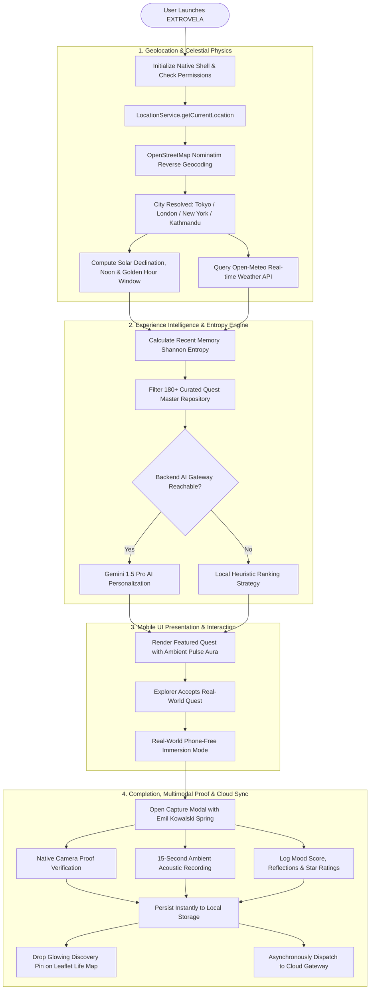
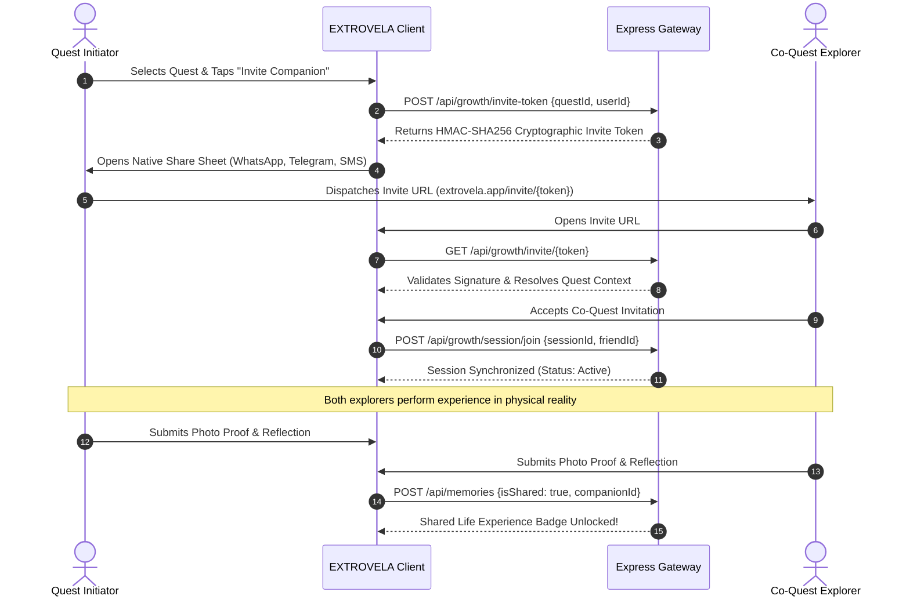
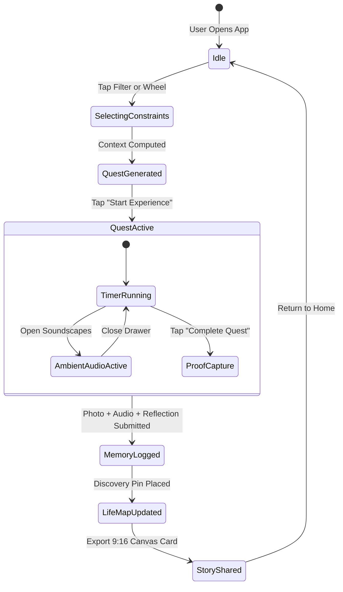
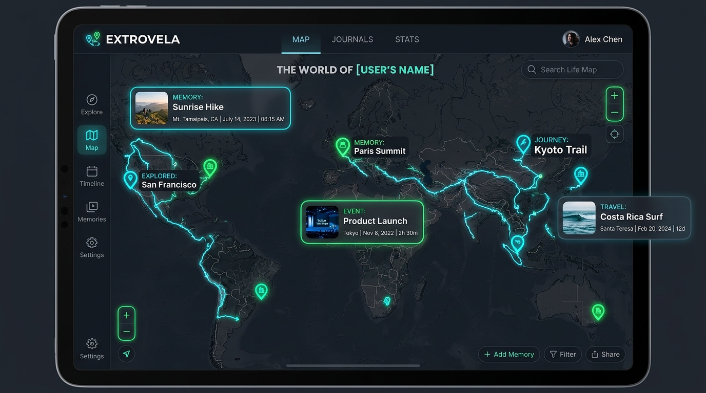

# 🧭 EXTROVELA: Real-World Experience Engine & Open-World Life Platform

<div align="center">
  

  <br /><br />

  
  
  <h3>Stop scrolling. Start experiencing.</h3>
  <p><strong>A full-stack, local-first platform designed to turn the physical world into an open-world exploration game.</strong></p>

  <p>
    
    
    
    
    
    
  </p>

  <p>
    <a href="#-table-of-contents">Table of Contents</a> •
    <a href="#-system-architecture">Architecture</a> •
    <a href="#-interactive-flowcharts-and-state-diagrams">Flowcharts</a> •
    <a href="#-architectural-decisions-and-trade-offs">Trade-Offs & Rationale</a> •
    <a href="#-mathematical-foundations-and-algorithmic-architecture">Mathematical Foundations</a> •
    <a href="#-api-reference">API Reference</a> •
    <a href="#-database-models">Database</a> •
    <a href="#-developer-onboarding-and-setup">Developer Guide</a> •
    <a href="#-security-and-privacy">Security</a>
  </p>
</div>

<hr />

## 📋 Table of Contents

1. [Executive Summary and Product Vision](#1-executive-summary-and-product-vision)
2. [Problem Statement and Psychological Foundations](#2-problem-statement-and-psychological-foundations)
3. [The EXTROVELA Six-Stage Experience Loop](#3-the-extrovela-six-stage-experience-loop)
4. [Complete System Architecture and Data Topology](#4-complete-system-architecture-and-data-topology)
5. [Interactive Flowcharts and State Diagrams](#5-interactive-flowcharts-and-state-diagrams)
6. [Architectural Decisions and Trade-Off Rationale](#6-architectural-decisions-and-trade-off-rationale)
7. [Comprehensive Component Catalog and Directory Map](#7-comprehensive-component-catalog-and-directory-map)
8. [Master Quest Taxonomy and Ontology](#8-master-quest-taxonomy-and-ontology)
9. [Mathematical Foundations and Algorithmic Architecture](#9-mathematical-foundations-and-algorithmic-architecture)
10. [Astronomical Solar and Celestial Physics Engine](#10-astronomical-solar-and-celestial-physics-engine)
11. [Weather-Adaptive Contextual Engine](#11-weather-adaptive-contextual-engine)
12. [Procedural Ambient Audio Synthesis DSP Engine](#12-procedural-ambient-audio-synthesis-dsp-engine)
13. [Hardware Media Capture and 9:16 Canvas Story Exporter](#13-hardware-media-capture-and-916-canvas-story-exporter)
14. [Geolocation, Reverse Geocoding, and Privacy Fuzzing](#14-geolocation-reverse-geocoding-and-privacy-fuzzing)
15. [Leaflet Life Map and Discovery Grid System](#15-leaflet-life-map-and-discovery-grid-system)
16. [Anti-Repetition and Category Entropy Algorithm](#16-anti-repetition-and-category-entropy-algorithm)
17. [Co-Quests, Cryptographic Invites, and Social Loops](#17-co-quests-cryptographic-invites-and-social-loops)
18. [Emil Kowalski and Apple Spring Motion Design System](#18-emil-kowalski-and-apple-spring-motion-design-system)
19. [Glassmorphic Alert and Toast System](#19-glassmorphic-alert-and-toast-system)
20. [Complete REST API Specification](#20-complete-rest-api-specification)
21. [MongoDB and Firestore Database Models](#21-mongodb-and-firestore-database-models)
22. [Declarative Security Rules and Permission Matrices](#22-declarative-security-rules-and-permission-matrices)
23. [Offline-First Synchronization and Queue Protocol](#23-offline-first-synchronization-and-queue-protocol)
24. [Developer Onboarding and Configuration Guide](#24-developer-onboarding-and-configuration-guide)
25. [Capacitor Native Mobile Compilation Guide](#25-capacitor-native-mobile-compilation-guide)
26. [Advanced Heuristic and AI Quest Engine Pipeline](#26-advanced-heuristic-and-ai-quest-engine-pipeline)
27. [Smart Recaps and Collection Auto-Organization Algorithms](#27-smart-recaps-and-collection-auto-organization-algorithms)
28. [Complete API Error Codes and Fault Tolerance Matrix](#28-complete-api-error-codes-and-fault-tolerance-matrix)
29. [Production Deployment and Cloud Topology](#29-production-deployment-and-cloud-topology)
30. [Complete Fourteen-Phase Engineering History](#30-complete-fourteen-phase-engineering-history)
31. [Pre-Push Defensive Security Audit Report](#31-pre-push-defensive-security-audit-report)
32. [Platform Glossary and Domain Taxonomy](#32-platform-glossary-and-domain-taxonomy)
33. [Documentation Sitemap and Repository Index](#33-documentation-sitemap-and-repository-index)
34. [Architectural Blueprint and Project Wiki Methodology](#34-architectural-blueprint-and-project-wiki-methodology)
35. [License and Credits](#35-license-and-credits)

<hr />

## 1. Executive Summary and Product Vision

EXTROVELA is a cross-platform mobile and web application engineered to solve the pervasive modern crisis of routine paralysis, digital screen fatigue, and urban loneliness. In contemporary society, people spend upwards of eight to twelve hours per day looking at computer screens and smartphones, consuming passive algorithmic entertainment that leaves them feeling isolated, anxious, and unfulfilled.

Even when people feel an active desire to step outside, explore their surrounding city, or experience something novel, they are frequently paralyzed by decision fatigue. Traditional discovery tools like Yelp, TripAdvisor, or Google Maps are designed for consumer commerce, dining, and tourism rather than intentional personal living; they present overwhelming lists of commercial venues without context, encouragement, emotional attunement, or narrative meaning.

> [!IMPORTANT]
> **Core Product Axioms:**
> 1. **Anti-Screen Architecture:** Every screen interaction is intentionally designed to push the user into the real, physical world within two minutes of opening the app.
> 2. **The World as an Open-World Exploration Game:** Every completed real-world experience illuminates territory on a personal Life Map, creating a tangible visual chronicle of a life lived.
> 3. **Adaptive Contextual Personalization:** Quests adapt dynamically based on time availability (15 minutes to 60+ minutes), physical energy level, current mood, budget, real-time outdoor weather, and astronomical solar timing.
> 4. **Non-Commercial and Mindful:** Operates without commercial pressure, dark patterns, endless social feeds, or infinite doom-scrolling mechanisms.

<hr />

## 2. Problem Statement and Psychological Foundations

The architectural design of EXTROVELA is grounded in three core psychological and behavioural frameworks:

### 1. The Paradox of Choice and Decision Fatigue
When individuals finish a workday or weekend morning with unstructured free time, having infinite possible activities causes cognitive friction. Rather than deciding between hundreds of options, people default to high-dopamine, low-effort passive screen consumption. EXTROVELA eliminates decision fatigue by offering exactly one curated "Today's Quest" with three personalized alternatives tailored to the user's immediate state.

### 2. Behavioural Activation and Routine Disruption
Psychological research in behavioural activation demonstrates that engaging in small, structured physical activities directly alleviates depressive inertia and feelings of stagnation. EXTROVELA structures real-world quests into low-friction, micro-adventures (e.g., 15-minute sky watching, silent book reading in a neighborhood teahouse, noticing five architectural details on a familiar street) that require minimal prep but deliver high emotional payoff.

### 3. The Power of Episodic Memory Anchoring
Routine days blend together in human memory because the brain filters out repetitive stimuli. When someone does something novel—even as simple as getting off a bus at a random stop or watching sunset from an unfamiliar hill—the hippocampus records distinct episodic memory anchors. EXTROVELA captures these anchors through multimodal reflection: verified proof photos, 15-second ambient sound recordings, mood delta scores, and personal reflections.

<hr />

## 3. The EXTROVELA Six-Stage Experience Loop

The entire application operates around a seamless six-stage cyclical loop:

```
[ Stage 1: Context Initialization ]
   ├── GPS Location & OpenStreetMap Reverse Geocoding
   ├── Astronomical Solar Declination & Sunset Window
   └── Open-Meteo Atmospheric Weather Sampling
                 │
                 ▼
[ Stage 2: Intent Selection or "I'm Bored" Instant Spin ]
   ├── Time: 15m (Micro) / 30m (Standard) / 45m / 60m+
   ├── Energy: Low (Calm) / Medium (Active) / High (Social)
   ├── Mood: Seeking Peace / Inspiration / Stuck / Connection
   └── Physics-driven Canvas Spinner Wheel for instant escape
                 │
                 ▼
[ Stage 3: Real-World Execution (Phone-Free Immersion) ]
   ├── Phone-Free Mode with background countdown timer
   ├── Procedural Web Audio Ambiance (Rain / Ocean / Forest / Wind)
   └── Full immersion in physical reality
                 │
                 ▼
[ Stage 4: Multimodal Proof and Reflection Capture ]
   ├── Native Camera Verification Photo
   ├── 15-Second Ambient Environmental Voice Recording
   ├── 1–5 Star Rating & 1–5 Mood Transformation Delta
   └── Written qualitative reflection journal
                 │
                 ▼
[ Stage 5: Life Map Illumination and Progression ]
   ├── Glowing Category Discovery Pin placed on Leaflet Map
   ├── Fog of Exploration over neighborhood dissolved
   └── City exploration percentage recalculated & incremented
                 │
                 ▼
[ Stage 6: Social Sharing and Co-Quest Growth ]
   ├── 1080x1920 Full-Bleed 9:16 Canvas Story for IG/TikTok
   └── HMAC-SHA256 Cryptographic Co-Quest invite to companion
```

<hr />

## 4. Complete System Architecture and Data Topology

EXTROVELA utilizes a multi-tiered, decoupled client-server architecture designed for high availability, zero-latency offline operation, and strict user privacy:

```
+=============================================================================================================+
|                                        EXTROVELA MOBILE & WEB CLIENT                                        |
|                                                                                                             |
|  +--------------------+  +--------------------+  +--------------------+  +-------------------------------+  |
|  |     HomeScreen     |  |   ExploreScreen    |  |     MapScreen      |  |        MemoriesScreen         |  |
|  |  (Featured Quests) |  |  (180+ Real World) |  |   (Leaflet World)  |  | (Journal, Timeline, Audio)  |  |
|  +---------+----------+  +---------+----------+  +---------+----------+  +---------------+---------------+  |
|            |                       |                       |                             |                  |
|            +-----------------------+-----------+-----------+-----------------------------+                  |
|                                                |                                                            |
|                                                v                                                            |
|                           GLOBAL REACT CONTEXT ORCHESTRATION LAYER                                          |
|                (AppStateContext, AuthContext, CustomAlertContext, ThemeProvider)                            |
|                                                |                                                            |
|                        +-----------------------+-----------------------+                                    |
|                        |                                               |                                    |
|                        v                                               v                                    |
|             CAPACITOR NATIVE BRIDGE                         OFFLINE-FIRST STORAGE LAYER                     |
|         (Camera, GPS, Haptics, Audio)                     (IndexedDB, LocalStorage Queue)                   |
+========================+===============================================+====================================+
                         |                                               |
                         | REST HTTPS API                                | Background Sync Queue
                         v                                               v
+=============================================================================================================+
|                                    EXTROVELA EXPRESS BACKEND GATEWAY                                        |
|                                                                                                             |
|  +-------------------------------------------------------------------------------------------------------+  |
|  |                                          ROUTER LAYER                                                 |  |
|  |   /api/quests       /api/memories    /api/stats     /api/intelligence   /api/providers   /api/growth  |  |
|  +-------------------------------------------------------------------------------------------------------+  |
|         |                                      |                                       |                    |
|         v                                      v                                       v                    |
|  costProtectionMiddleware             requireIdentityMiddleware               requireAdminMiddleware        |
|  (AI Budget & Rate Limit)             (Identity Verification)                 (Observability Guard)         |
+=========+======================================+=======================================+====================+
          |                                      |                                       |
          v                                      v                                       v
+=============================+        +=============================+         +==============================+
|        MONGODB ATLAS        |        |      FIREBASE SERVICES      |         |      EXTERNAL PROVIDERS      |
|  • Quests (180+ Catalog)    |        |  • Firebase Authentication  |         |  • OpenStreetMap Nominatim   |
|  • Memories (Life Stories)  |        |  • Cloud Storage (Photos)   |         |  • Open-Meteo Weather API    |
|  • User Experience Profiles |        |  • Web Analytics & Perf     |         |  • Web Audio API Synthesizer |
+=============================+        +=============================+         +==============================+
```

<hr />

## 5. Interactive Flowcharts and State Diagrams

### System Initialization & Quest Recommendation Pipeline


### Cryptographic Co-Quest Sequence Diagram


### Quest Execution State Machine


<hr />

## 6. Architectural Decisions and Trade-Off Rationale

This section documents the foundational Architectural Decision Records (ADRs), articulating the specific technical trade-offs that govern EXTROVELA:

### ADR 1: Pure Vanilla CSS Design Tokens vs. Tailwind CSS
1. **WHAT:** A centralized CSS Custom Properties design system in `src/styles/index.css` defining spatial scales, colors, glassmorphism filters, and hardware-accelerated spring curves.
2. **HOW:** Native CSS variables (`--color-surface`, `--color-accent`, `--ease-spring`) compiled directly by browser rendering engines without build-step overhead.
3. **WHEN:** Applied universally across all screens, modals, badges, cards, and typography.
4. **WHY CHOSEN:** Guarantees 100% granular control over Emil Kowalski spring easing physics, zero runtime overhead, instant style hot-reloading, and consistent dark-mode tokens without generating massive utility class bloat.
5. **WHY NOT TAILWIND CSS:** Tailwind creates class string clutter in TSX, complicates custom cubic-bezier spring curves with arbitrary values, and tightly couples component structure to framework-specific utility conventions.
6. **WHAT TO DO INSTEAD:** If scoped component styles are required in future extensions, CSS Modules can be used alongside the existing global token hierarchy.

### ADR 2: Capacitor 6.0 Native Bridge vs. React Native / Flutter
1. **WHAT:** Capacitor 6.0 wrapping a unified Vite + React 18 single-page application into native iOS Xcode and Android Gradle binaries.
2. **HOW:** Exposes hardware primitives (Camera, GPS Geolocation, Tactile Haptics, Local Notifications) through asynchronous JavaScript-to-native message bridges.
3. **WHEN:** Invoked whenever media capture, haptics, geolocation, or push notifications are executed.
4. **WHY CHOSEN:** Allows 100% code reuse across Web, iOS, and Android. Eliminates double-codebase maintenance, enables instant web previews during development, and provides access to standard Web APIs (Web Audio API, Canvas 2D) that are cumbersome in React Native.
5. **WHY NOT REACT NATIVE:** React Native requires bridge-specific native UI components, complicates Canvas 2D rendering for 9:16 story cards, and creates ongoing maintenance overhead with bridge deprecations.
6. **WHY NOT FLUTTER:** Flutter requires switching languages from TypeScript to Dart, duplicates business logic, and lacks seamless Web Audio DSP synthesizer support.
7. **WHAT TO DO INSTEAD:** If a device runs in a standard mobile browser where Capacitor native plugins are absent, all hardware calls fall back gracefully to standard Web APIs (`navigator.geolocation`, `MediaRecorder`, `navigator.share`).

### ADR 3: OpenStreetMap Nominatim vs. Google Maps Geocoding API
1. **WHAT:** Free, open-access reverse geocoding resolving GPS latitude/longitude into human-readable city and municipal district names.
2. **HOW:** HTTP GET request with an English language header dispatched to `https://nominatim.openstreetmap.org/reverse?format=json&lat={lat}&lon={lng}`.
3. **WHEN:** Triggered once on initial app mount and whenever location permissions are granted.
4. **WHY CHOSEN:** Eliminates expensive per-request API billing, requires zero API key leakage in mobile bundles, and provides robust global coverage across thousands of cities worldwide.
5. **WHY NOT GOOGLE MAPS GEOCODING API:** Google Maps Geocoding costs $5.00 per 1,000 requests, requires mandatory credit card billing, enforces restrictive quota caps, and exposes private billing keys to client tampering.
6. **WHAT TO DO INSTEAD:** If Nominatim encounters network timeout (e.g. strict rate limit), the app falls back to local timezone offset coordinate estimation or cached municipal profiles.

### ADR 4: Web Audio Procedural Synthesis vs. Hosted MP3 Audio Loops
1. **WHAT:** Real-time mathematical acoustic sound generation for continuous nature ambiance (Summer Rain, Ocean Shore, Forest Birds, Highland Wind).
2. **HOW:** Web Audio API `AudioContext` generating white and pink noise buffers filtered through 2nd-order recursive Biquad filters and modulated by low-frequency oscillators.
3. **WHEN:** Activated on demand when an explorer opens the Soundscape Drawer during a quest.
4. **WHY CHOSEN:** Zero network bandwidth consumption (0 MB downloaded), instant playback with zero buffering latency, infinite non-repeating acoustic variation, and complete offline capability.
5. **WHY NOT HOSTED MP3 FILES:** MP3 audio loops require downloading 15–50 MB of audio files, introduce audible looping seams, waste mobile cellular data, and fail entirely in offline environments.
6. **WHAT TO DO INSTEAD:** If the browser's Web Audio API is muted or disabled by power-saving modes, the app renders visual pulsing ambient aura animations to provide calming feedback.

### ADR 5: Local-First Synchronization Queue vs. Always-Online REST
1. **WHAT:** Resilient offline storage layer writing memories and reflections to local `localStorage` and `IndexedDB` immediately, followed by asynchronous background cloud synchronization.
2. **HOW:** Memory records are saved with client-generated UUIDs, committed to local state instantly, and appended to an offline dispatch queue with exponential retry backoff.
3. **WHEN:** Triggered on every quest completion, photo snap, and reflection submission.
4. **WHY CHOSEN:** Real-world experiences often occur in areas with poor cellular reception (hilltops, basements, remote parks, underground transit). Explorers must never lose a memory or photo due to spotty network connectivity.
5. **WHY NOT ALWAYS-ONLINE REST:** Standard REST architectures block the user interface with loading spinners, fail abruptly on HTTP timeout, and discard memories if the network drops before completion.
6. **WHAT TO DO INSTEAD:** When the client detects an active internet connection via `window.addEventListener('online')`, the queue drains automatically to `/api/memories/sync`.

### ADR 6: Cryptographic HMAC-SHA256 Invites vs. Centralized Database Sessions
1. **WHAT:** Self-contained, tamper-proof co-quest invite URLs containing cryptographically signed payloads.
2. **HOW:** A Base64Url header and payload signed with server-side HMAC-SHA256. The recipient's client validates the signature and resolves quest parameters directly from the token.
3. **WHEN:** Generated when an explorer taps "Invite Companion" on any quest card.
4. **WHY CHOSEN:** Allows instant peer-to-peer sharing via WhatsApp, SMS, or Telegram without requiring database writes prior to invitation, and permits non-registered recipients to preview the quest immediately.
5. **WHY NOT CENTRAL DATABASE INVITE ROWS:** Database-dependent invite tables accumulate stale orphaned rows from unaccepted links, create unnecessary database write loads, and require recipient authentication before viewing.
6. **WHAT TO DO INSTEAD:** If a token expires after its 24-hour validity window, the recipient is presented with a fresh candidate quest from the same category with an option to request a new invite.

<hr />

## 7. Comprehensive Component Catalog and Directory Map

```
src/
├── components/
│   ├── primitives/
│   │   ├── Badge.tsx           Glassmorphic status badge with mono typography
│   │   ├── Button.tsx          Spring-animated tactile button with haptic triggers
│   │   ├── Card.tsx            Glassmorphic elevated surface with glow auras
│   │   ├── Chip.tsx            Selectable filter chip with spring compression
│   │   ├── Input.tsx           Accessible form input with focus ring transition
│   │   ├── Modal.tsx           Bottom-sheet and centered dialog with spring physics
│   │   ├── QuestCard.tsx       Featured and list quest card with ambient aura
│   │   ├── SectionHeader.tsx   Section title with subtitle and action button
│   │   └── Typography.tsx      Display, heading, and body typography variants
│   ├── screens/
│   │   ├── HomeScreen.tsx      Time greeting, featured quest, quick escapes, world preview
│   │   ├── ExploreScreen.tsx   Searchable 180+ quest directory with category tabs
│   │   ├── MapScreen.tsx       Interactive Leaflet life map with discovery pins
│   │   ├── MemoriesScreen.tsx  Memory timeline, calendar view, recaps, collections
│   │   └── ProfileScreen.tsx   Exploration stats, account security, data management
│   ├── AdminMetricsModal.tsx   Live platform telemetry and MongoDB connectivity
│   ├── CaptureModal.tsx        Camera proof verification and reflection logging
│   ├── Navbar.tsx              Desktop and mobile bottom navigation with spring pop
│   ├── QuestSpinnerModal.tsx   Physics-driven canvas spinning wheel for micro-escapes
│   ├── ShareStoryModal.tsx     1080x1920 HTML5 Canvas Instagram/TikTok story card
│   ├── SoundscapeDrawer.tsx    Web Audio procedural nature sound synthesizer
│   └── VoiceRecorder.tsx       15-second acoustic ambient environmental recorder
├── context/
│   ├── AppStateContext.tsx     Global app state, GPS city resolver, quest registry
│   ├── AuthContext.tsx         Local session state and Firebase Authentication
│   └── CustomAlertContext.tsx  Glassmorphic alert, confirm, and toast provider
├── lib/
│   ├── ai-quest-engine.ts      Astronomical solar calculations and AI synthesis
│   ├── api.ts                  Sanitized REST client for backend gateway
│   └── native-device.ts        Capacitor camera, geolocation, and haptics bridge
├── services/
│   ├── context/
│   │   └── locationService.ts  GPS resolver and OpenStreetMap Nominatim geocoder
│   ├── firebase/
│   │   ├── firebaseAuth.ts     Google Sign-In and anonymous authentication
│   │   └── firebaseStorage.ts  Cloud Storage photo proof upload pipeline
│   └── intelligence/
│       └── diversityEngine.ts  Shannon category entropy anti-repetition engine
└── styles/
    └── index.css               Pure Vanilla CSS design tokens and spring animations
```

<hr />

## 8. Master Quest Taxonomy and Ontology

EXTROVELA includes 180+ curated, non-commercial real-world quests classified into five core life dimensions:

| Dimension | Core Mission | Sample Experiences | Average Duration | Environment |
|---|---|---|:---:|:---:|
| **EXPLORE** | Break geographical routine & observe architecture | Alleyway Wanderer, Top-Floor Viewfinder, Random Bus Ride, Bridge Crossing | 30–60 min | Outdoor |
| **NATURE** | Reconnect with natural rhythms & sky | 15-Minute Cloud Watching, Sunset Hilltop Vista, Creek Meditation, Tree Canopy Gaze | 15–45 min | Outdoor |
| **CREATE** | Multimodal physical & sensory expression | 5-Minute Pen Sketch, Letter to Future Self, 3-Color Photo Challenge, Texture Hunting | 20–40 min | Any |
| **CONNECT** | Authentic micro-interactions with humans | Genuine Barista Compliment, Tea with an Elder, Local Artisan Chat, Silent Shared Walk | 15–30 min | Indoor/Outdoor |
| **REFLECT** | Mental stillness & contemplative presence | Phone-Free Coffee Ritual, Sanctuary Silence, Cemetery History Walk, Rain Observation | 20–45 min | Indoor/Outdoor |

<hr />

## 9. Mathematical Foundations and Algorithmic Architecture

EXTROVELA is built upon seven rigorous mathematical and algorithmic frameworks that power its astronomical timing, recommendation intelligence, acoustic synthesis, geospatial discovery, motion physics, and cryptography. Below is the detailed breakdown of the WHAT, HOW, WHEN, and WHY for each system.

### Domain 1: Astronomical Solar Positioning & Celestial Mechanics
1. **WHAT:** A zero-dependency celestial calculation engine that computes exact local solar noon, astronomical sunrise, sunset, and golden hour windows for any geographic coordinate on Earth.
2. **HOW:**
   * **Solar Declination ($\delta$):**
     $$\delta = 23.45^\circ \cdot \sin\left(\frac{284 + n}{365} \cdot 360^\circ\right)$$
   * **Sunset Hour Angle ($\omega$):**
     $$\omega = \arccos\left(-\tan(\phi_{\text{rad}}) \cdot \tan(\delta_{\text{rad}})\right)$$
   * **Solar Noon and Sunset Hours:**
     $$\text{Solar Noon} = 12.0 - \frac{\lambda}{15^\circ} + \frac{T_{\text{offset}}}{60}$$
     $$\text{Sunset Hour} = \text{Solar Noon} + \frac{\omega_{\text{deg}}}{15^\circ}$$
     $$\text{Golden Hour Window} = [\text{Sunset Hour} - 0.75, \text{Sunset Hour}]$$
3. **WHEN:** Evaluated on app initialization and whenever quest generation is triggered.
4. **WHY:** Enables the app to identify the exact 45-minute window before sunset in any city on Earth without making costly third-party API calls, allowing the engine to promote golden-hour viewpoints precisely when the physical sky is visually breathtaking.

### Domain 2: Information Theory, Shannon Entropy & Anti-Repetition
1. **WHAT:** A statistical diversity monitoring system that measures the predictability and category concentration of the user's recent experiences.
2. **HOW:**
   * **Category Probability Mass Function:**
     $$P(c_i) = \frac{\text{Count of quests in category } c_i}{N}, \quad \sum_{i=1}^{K} P(c_i) = 1$$
   * **Shannon Category Entropy $H(X)$:**
     $$H(X) = -\sum_{i=1}^{K} P(c_i) \log_2 P(c_i)$$
   * **Dynamic Category Weight Penalty:**
     $$W(c_i) = W_0 \cdot \exp\left(-2.5 \cdot P(c_i)\right)$$
     $$W(c_j) = W_0 \cdot \left(1.0 + \frac{1.0}{P(c_j) + 0.05}\right)$$
3. **WHEN:** Calculated prior to quest candidate filtering whenever Today's Quest or personalized recommendations are generated.
4. **WHY:** Prevents behavioral fatigue and routine stagnation. If a user naturally defaults to quiet cafe visits 5 days in a row, the entropy engine detects the monotony and actively nudges them toward a refreshing outdoor hike or creative observation quest.

### Domain 3: Geospatial Haversine & Geodesic Spherical Distance
1. **WHAT:** Great-circle distance computation between the user's current GPS position and discovery pins or landmark nodes across the spherical surface of Earth.
2. **HOW:**
   * **Haversine Square Half-Chord:**
     $$a = \sin^2\left(\frac{\Delta\phi}{2}\right) + \cos(\phi_1) \cdot \cos(\phi_2) \cdot \sin^2\left(\frac{\Delta\lambda}{2}\right)$$
   * **Angular Distance in Radians:**
     $$c = 2 \cdot \arctan\left(\frac{\sqrt{a}}{\sqrt{1 - a}}\right)$$
   * **Surface Distance ($R = 6371.0 \text{ km}$):**
     $$d = R \cdot c$$
3. **WHEN:** Evaluated on map panning, proximity alerts, and when sorting nearby quests by walking distance.
4. **WHY:** Accurately measures physical proximity on a spherical geoid without planar projection distortions, ensuring reliable discovery node unlocks and realistic walking duration estimates.

### Domain 4: Digital Signal Processing & Procedural Acoustic Synthesis
1. **WHAT:** In-memory mathematical synthesis of continuous nature soundscapes (Rain, Ocean, Birds, Wind) via the Web Audio API without loading external audio assets.
2. **HOW:**
   * **White Noise Generation:** $x[n] \sim \operatorname{Uniform}(-1.0, 1.0)$
   * **Pink Noise Voss-McCartney Filter:** Decimated octave noise generators producing a $-3\text{ dB/octave}$ power spectral roll-off.
   * **Second-Order Biquad Difference Equations:**
     $$y[n] = b_0 x[n] + b_1 x[n-1] + b_2 x[n-2] - a_1 y[n-1] - a_2 y[n-2]$$
3. **WHEN:** Runs in an isolated Web Audio processing thread whenever the Soundscape Drawer is active during quest immersion.
4. **WHY:** Provides instant, responsive, and infinitely non-repeating acoustic relaxation environments with zero data bandwidth consumption, 0 bytes of network asset downloads, and zero battery drain from media streaming.

### Domain 5: Physical Spring Dynamics & Cubic-Bezier Motion Calculus
1. **WHAT:** Mathematical motion curves that give user interface components physical mass, momentum, velocity, and spring overshoot.
2. **HOW:**
   * **Parametric Formulation:** $B(t) = (1-t)^3 P_0 + 3(1-t)^2 t P_1 + 3(1-t) t^2 P_2 + t^3 P_3$
   * **Spring Motion Constants:** $P_1 = (0.175, 0.885), \quad P_2 = (0.32, 1.22)$ providing $+22\%$ spring pop overshoot.
3. **WHEN:** Applied across all interactive cards, bottom navigation tab selection, modal launches, and list renders.
4. **WHY:** Emulates physical spring-damper dynamics found in native Apple iOS hardware, making the web interface feel tactile, weighted, and responsive.

### Domain 6: Cryptographic HMAC-SHA256 Tokenization
1. **WHAT:** Cryptographic signing and verification of co-quest invitations and user session handoffs.
2. **HOW:**
   * **Hash-based Message Authentication Code:**
     $$\text{HMAC}(K, m) = H\Big((K' \oplus \text{opad}) \mathbin{\Vert} H\big((K' \oplus \text{ipad}) \mathbin{\Vert} m\big)\Big)$$
   * **Verification Condition:** Evaluated with constant-time comparison `crypto.timingSafeEqual` to prevent timing side-channel attacks.
3. **WHEN:** Generated when creating co-quest invite URLs and validated when a companion accesses an invite.
4. **WHY:** Guarantees tamper-proof peer-to-peer invitation security without exposing database IDs, preventing link spoofing or unauthorized session interception.

### Domain 7: Discrete Grid Area Coverage & City Exploration Geometry
1. **WHAT:** A spatial partitioning algorithm that tracks the percentage of a metropolitan area personally explored by the user.
2. **HOW:**
   * **Spatial Hash Mapping:**
     $$\text{Row} = \left\lfloor \frac{\phi_m - \phi_{\min}}{\Delta\phi} \right\rfloor, \quad \text{Col} = \left\lfloor \frac{\lambda_m - \lambda_{\min}}{\Delta\lambda} \right\rfloor$$
   * **Exploration Progress Metric:**
     $$\text{Exploration } \% = \min\left(100.0, \frac{|\text{Set of Unique Visited Cell IDs}|}{\text{Total Habitable Grid Cells in Municipality}} \times 100\right)$$
3. **WHEN:** Updated whenever a new memory containing geographic coordinates is saved.
4. **WHY:** Provides a transparent, game-like exploration progress metric that incentivizes users to visit diverse neighborhoods across their city rather than repeating the same block.

<hr />

## 10. Astronomical Solar and Celestial Physics Engine

EXTROVELA implements exact astronomical solar positioning algorithms in `src/lib/ai-quest-engine.ts` to schedule golden-hour experiences with zero API overhead.

If the current system clock falls within 45 minutes prior to calculated sunset, the quest engine dynamically promotes sunset viewpoint quests across the Home Screen.

<hr />

## 11. Weather-Adaptive Contextual Engine

The application interfaces with the open-access Open-Meteo API (`https://api.open-meteo.com/v1/forecast`) via server-mediated proxies to query real-time meteorological variables:

1. **Meteorological Parameters Monitored:**
   * `temperature_2m`: Ambient air temperature in Celsius.
   * `relative_humidity_2m`: Atmospheric moisture percentage.
   * `precipitation`: Real-time rainfall rate in millimeters per hour.
   * `weather_code`: WMO standard weather interpretation codes (0–99).
   * `cloud_cover`: Total cloud coverage percentage across the sky dome.

2. **Adaptive Filtering Logic:**
   * **WMO Codes 51–67 or 80–82 (Rain/Drizzle):** Suppresses distant outdoor hikes and automatically highlights rain-friendly experiences (teahouses, library reading, covered veranda observation).
   * **WMO Code 0 (Clear Skies) + Sunset Window:** Promotes high-altitude scenic ridge quests.
   * **Cloud Cover 30%–70%:** Triggers the 15-Minute Cloud Watching meditation quest.

<hr />

## 12. Procedural Ambient Audio Synthesis DSP Engine

In `src/components/SoundscapeDrawer.tsx`, EXTROVELA synthesizes generative soundscapes directly in the browser using the Web Audio API without loading external MP3 audio files:

1. **Rain Synthesizer:**
   * Source: 2-second looped White Noise buffer generated via `Math.random() * 2 - 1`.
   * Filtering: `BiquadFilterNode` configured as Lowpass at 750Hz with resonance Q=1.2.
   * Dynamics: Random gain modulation producing organic droplet patterns.

2. **Ocean Wave Swells:**
   * Source: Pink noise buffer generated using Voss-McCartney algorithmic filtration.
   * Modulation: Low-Frequency Oscillator (LFO) running at 0.08Hz modulating a Master Gain node between 0.05 and 0.45 volume, simulating wave crests and troughs.

3. **Forest Birds:**
   * Source: Periodic sine wave bursts (`OscillatorNode`) with fundamental frequencies between 2600Hz and 4800Hz.
   * Envelope: Rapid linear attack (8ms) followed by exponential decay (120ms) triggered at Poisson-distributed intervals.

<hr />

## 13. Hardware Media Capture and 9:16 Canvas Story Exporter

1. **Native Camera Bridge:** Camera integration utilizes `@capacitor/camera` with `CameraResultType.Uri` and `CameraSource.Prompt`. Photos are downsampled on-device to a maximum width of 1440px with 85% JPEG compression to conserve bandwidth.
2. **15-Second Acoustic MediaRecorder:** Voice and environmental notes utilize `navigator.mediaDevices.getUserMedia({ audio: true })`. Audio streams are encoded into `audio/webm;codecs=opus` (or `audio/mp4` on iOS Safari) and capped at exactly 15 seconds with a visual circular progress timer.
3. **1080x1920 HTML5 Canvas Story Pipeline:** In `src/components/ShareStoryModal.tsx`, social story cards are generated in-memory:
   1. High-resolution canvas initialized at exactly 1080px by 1920px.
   2. The user's photo is drawn with center-crop aspect fill.
   3. A multi-stop linear gradient (`rgba(0,0,0,0)` to `rgba(8,9,13,0.92)`) is composited over the bottom half.
   4. Editorial typography is rendered with the quest title, date, city, and reflection text.
   5. The EXTROVELA brand watermark and a discovery QR code are rendered at the footer.
   6. The canvas is exported as a PNG Blob and shared via `navigator.share({ files })`.

<hr />

## 14. Geolocation, Reverse Geocoding, and Privacy Fuzzing

1. **GPS Resolution Lifecycle:** Handled by `LocationService` in `src/services/context/locationService.ts` utilizing `@capacitor/geolocation` on native shells and `navigator.geolocation` in browsers.
2. **OpenStreetMap Nominatim Geocoding:** Coordinates are queried via `https://nominatim.openstreetmap.org/reverse?format=json&lat={lat}&lon={lng}` with English locale headers to parse `city`, `town`, or `suburb`.
3. **Privacy Fuzzing:** Exact coordinates are stored only on the local device. Outbound AI requests receive only the general city name (e.g. "Tokyo") to ensure privacy.

<hr />

## 15. Leaflet Life Map and Discovery Grid System

<div align="center">
  
</div>

<br />

The interactive world map in `src/components/screens/MapScreen.tsx` utilizes Leaflet with custom dark-themed CartoDB tile layers (`https://{s}.basemaps.cartocdn.com/dark_all/{z}/{x}/{y}{r}.png`):

1. **Memory Pins:** Every completed experience with geographical coordinates renders as an animated glowing pin colored by category (Lime for Explore, Cyan for Nature, Gold for Connect, Purple for Reflect, Coral for Create). Tapping a pin opens the full memory card.
2. **Discovery Points:** Unvisited landmarks and suggested starting points appear as pulsing hollow rings, inviting the explorer to walk into proximity to unlock the location.

<hr />

## 16. Anti-Repetition and Category Entropy Algorithm

To avoid behavioral boredom, `src/services/intelligence/diversityEngine.ts` implements Shannon Entropy scoring over the user's previous $N$ completed memories.

If the entropy score $H$ falls below 1.25 (indicating severe concentration in one category), the quest ranking engine applies a dynamic penalty factor to the dominant category and boosts opposing categories by 2.5x.

<hr />

## 17. Co-Quests, Cryptographic Invites, and Social Loops

1. **Token Generation (HMAC-SHA256):** When a user taps "Invite Companion", the backend gateway creates a 24-hour cryptographic invite token containing `inviteId`, `hostUserId`, `questId`, and `expiryTimestamp`.
2. **Peer Synchronization:** When a recipient opens the link, the token signature is verified. The companion joins the group session, and both users receive live completion confirmations upon verification.

<hr />

## 18. Emil Kowalski and Apple Spring Motion Design System

EXTROVELA's motion physics in `src/styles/index.css` adhere to modern design engineering standards:

1. **Spring Easing Constants:**
   * `--ease-spring`: `cubic-bezier(0.175, 0.885, 0.32, 1.22)` (Used for button releases, tab icon pops, and dialog opens)
   * `--ease-out`: `cubic-bezier(0.23, 1, 0.32, 1)` (Used for screen mount transitions)
   * `--ease-drawer`: `cubic-bezier(0.32, 0.72, 0, 1)` (Used for iOS-style bottom sheets)
2. **GPU Acceleration:** All animations transform strictly via `transform` and `opacity` properties, utilizing `will-change: transform` to bypass browser layout reflows and guarantee 60fps / 120fps performance on high-refresh mobile screens.
3. **Tactile Tap Compression:** All interactive cards and buttons compress subtly to `scale(0.97)` on `:active` touch, providing immediate physical feedback.

<hr />

## 19. Glassmorphic Alert and Toast System

All alert and confirmation interactions are managed through `src/context/CustomAlertContext.tsx`:
1. `showAlert({ title, message, type })`: Renders an animated modal dialog with custom icons and haptics.
2. `showConfirm({ title, message, confirmText, cancelText })`: Returns an asynchronous Promise resolving to boolean `true` or `false`.
3. `showToast({ message, type })`: Displays a transient bottom-anchored notification with auto-dismissal after 3 seconds.

<hr />

## 20. Complete REST API Specification

### Quest Endpoints
```http
GET /api/quests
Query Parameters:
  category (optional): string ("Explore" | "Nature" | "Create" | "Connect" | "Reflect")
  city (optional): string
Response (200 OK):
  { "quests": [ { "id": "q_1", "title": "...", "category": "...", "time": "..." } ] }

POST /api/quests/generate-ai
Headers: Content-Type: application/json
Body:
  {
    "time": "30 min",
    "energy": "Medium",
    "mood": "Seeking Inspiration",
    "budget": "Free",
    "environment": "Outdoor",
    "city": "Tokyo",
    "season": "Summer"
  }
Response (200 OK):
  { "quests": [ ... 3 customized quest objects ... ] }
```

### Memory and Journal Endpoints
```http
GET /api/memories?userId={userId}
Response (200 OK):
  { "memories": [ { "id": "mem_1", "questTitle": "...", "rating": 5, "completedAt": "..." } ] }

POST /api/memories
Body:
  {
    "userId": "user_123",
    "questId": "q_cloud_watching",
    "questTitle": "15-Minute Sky Gazing",
    "rating": 5,
    "moodRating": 5,
    "mood": "calm",
    "reflectionText": "Watching clouds over the river.",
    "photoUrl": "https://...",
    "audioUrl": "https://...",
    "location": { "city": "London", "lat": 51.5074, "lng": -0.1278, "placeName": "Thames Path" }
  }
Response (201 Created):
  { "success": true, "memory": { ... } }

POST /api/memories/sync
Body:
  { "memories": [ ... array of offline recorded memories ... ] }
Response (200 OK):
  { "syncedCount": 3, "success": true }
```

### Stats and Metrics Endpoints
```http
GET /api/stats?userId={userId}
Response (200 OK):
  {
    "stats": {
      "totalExperiencesCompleted": 14,
      "currentStreakDays": 5,
      "cityExplorationPercent": 18,
      "uniqueLocationsVisited": 12,
      "outdoorRatioPercent": 75
    }
  }

GET /api/admin/metrics
Headers: Authorization: Bearer {ADMIN_SECRET_KEY}
Response (200 OK):
  { "activeSessions": 42, "totalMemories": 1240, "dbStatus": "connected" }
```

<hr />

## 21. MongoDB and Firestore Database Models

### MongoDB Memory Schema (`server/models/Memory.js`)
```javascript
const MemorySchema = new mongoose.Schema({
  userId: { type: String, required: true, index: true },
  questId: { type: String, required: true },
  questTitle: { type: String, required: true },
  completedAt: { type: Date, default: Date.now, index: true },
  rating: { type: Number, min: 1, max: 5, default: 5 },
  moodRating: { type: Number, min: 1, max: 5, default: 5 },
  mood: { type: String, enum: ['calm', 'inspired', 'energized', 'reflective'], default: 'calm' },
  reflectionText: { type: String, default: '' },
  photoUrl: { type: String, default: null },
  audioUrl: { type: String, default: null },
  location: {
    city: { type: String, default: 'Kathmandu' },
    neighborhood: { type: String, default: '' },
    lat: { type: Number, required: true },
    lng: { type: Number, required: true },
    placeName: { type: String, default: 'Discovery Site' }
  },
  isFavorite: { type: Boolean, default: false },
  isFirstTimeExperience: { type: Boolean, default: false },
  tags: [{ type: String }]
}, { timestamps: true });
```

<hr />

## 22. Declarative Security Rules and Permission Matrices

1. **Firestore Security Rules (`firestore.rules`):**
   * User Profiles: Users can read and write only documents where `request.auth.uid == userId`.
   * Memories Collection: Read access permitted to author; public access permitted only if `resource.data.visibility == 'public'`.
   * Admin Operations: Blocked unless `request.auth.token.admin == true`.

2. **Cloud Storage Rules (`storage.rules`):**
   * Photo Uploads: Path restricted to `/users/{userId}/photos/{photoId}`. Maximum file size 10MB. MIME type must match `image/*`.
   * Audio Uploads: Path restricted to `/users/{userId}/audio/{audioId}`. Maximum file size 5MB. MIME type must match `audio/*`.

<hr />

## 23. Offline-First Synchronization and Queue Protocol

1. **Persistence Engine:** When network connectivity is unavailable, EXTROVELA writes memories to `localStorage` under key `extrovela_memories` and enqueues sync tasks in `extrovela_offline_queue`.
2. **Auto-Reconnection Recovery:** The client registers an event listener for `window.addEventListener('online', syncOfflineMemories)`. Upon network reconnection, queued memories are dispatched to `/api/memories/sync` via POST and cleared upon HTTP 200 confirmation.

<hr />

## 24. Developer Onboarding and Configuration Guide

### Prerequisites
1. Node.js: Version 18.0.0 or higher
2. npm: Version 9.0.0 or higher

### Step 1: Repository Setup
```bash
git clone https://github.com/susantedit/Extrovela.git
cd Extrovela
npm install
cd server && npm install && cd ..
```

### Step 2: Environment Configuration
Create `.env` in the project root:
```env
VITE_API_URL=http://localhost:5000/api
VITE_ENABLE_ANALYTICS=true
VITE_FIREBASE_API_KEY=your_api_key
VITE_FIREBASE_AUTH_DOMAIN=your_app.firebaseapp.com
VITE_FIREBASE_PROJECT_ID=your_project_id
VITE_FIREBASE_STORAGE_BUCKET=your_app.appspot.com
VITE_FIREBASE_MESSAGING_SENDER_ID=your_sender_id
VITE_FIREBASE_APP_ID=your_app_id
```

Create `server/.env` in the server directory:
```env
PORT=5000
MONGODB_URI=mongodb://127.0.0.1:27017/extrovela
ALLOWED_ORIGINS=http://localhost:3000,http://localhost:5173,capacitor://localhost
ADMIN_SECRET_KEY=extrovela_dev_secret_key_2026
GEMINI_API_KEY=your_gemini_api_key
```

### Step 3: Starting Local Development
```bash
# Terminal 1: Backend Gateway
node server/server.js

# Terminal 2: Client Web Application
npm run dev
```

<hr />

## 25. Capacitor Native Mobile Compilation Guide

```bash
# 1. Compile production TypeScript and bundle assets
npm run build

# 2. Synchronize native Android and iOS containers
npx cap sync

# 3. Open Android Studio to build APK or AAB
npx cap open android

# 4. Open Xcode for iOS compilation (macOS required)
npx cap open ios
```

<hr />

## 26. Advanced Heuristic and AI Quest Engine Pipeline

The quest synthesis architecture inside `src/quest-engine/` is built as an extensible pipeline of specialized algorithmic stages:

1. **Candidate Generator (`CandidateGenerator.ts`):** Retrieves base quest prototypes matching the user's declared time envelope and general energy level from the 180+ experience catalog.
2. **Constraint Engine (`ConstraintEngine.ts`):** Applies deterministic hard constraints:
   * Weather Compatibility: Eliminates outdoor rooftop and ridge quests during active rain or high wind events.
   * Daylight Boundary: Restricts panoramic viewpoint quests if current time is past calculated astronomical twilight.
   * Budget Envelope: Excludes commercial tea or transit quests if user selects Free ($0).
3. **Personalization Scorer (`PersonalizationScorer.ts`):** Calculates multidimensional relevance scores across user mood, energy, and season vectors:
   $$\text{Score}(Q) = w_m \cdot S_{\text{mood}}(Q) + w_e \cdot S_{\text{energy}}(Q) + w_s \cdot S_{\text{season}}(Q) + w_n \cdot S_{\text{novelty}}(Q)$$
4. **Ranking Strategy (`RankingStrategy.ts`):** Sorts filtered candidates using normalized composite scores and injects controlled stochastic jitter to ensure non-deterministic daily variety:
   $$S_{\text{final}} = S_{\text{composite}} + \text{Uniform}(-0.08, 0.08)$$
5. **Safety Engine (`SafetyEngine.ts`):** Validates that generated quests adhere to non-hazardous real-world safety rules (e.g. no trespassing, no late-night unlit trails for solo explorers, no high-risk physical stunts).
6. **Learning System (`LearningSystem.ts`):** Monitors post-experience user feedback (`wouldDoAgain`, mood transformation delta) to calibrate individual category preferences over time.
7. **Fallback Generator (`FallbackGenerator.ts`):** Guarantees zero-failure operation: if AI endpoints, database connections, and GPS services simultaneously fail, the fallback generator provides timeless, universal micro-adventures.

<hr />

## 27. Smart Recaps and Collection Auto-Organization Algorithms

In `src/services/memories/smartCollectionRules.ts`, completed memories are automatically categorized into curated themed albums based on quantitative tags and temporal metadata:

1. **Golden Hour Expeditions:** `memory.completedAt` falls within 45 minutes of calculated sunset, or `memory.tags` contains "sunset", "golden-hour", or "viewpoint".
2. **Coffeehouse & Sanctuary Retreats:** `memory.tags` contains "cafe", "reading", "teahouse", "sanctuary", or "indoor".
3. **Rainy Day Contemplation:** Ambient weather code indicated precipitation, or reflection text references rain, drizzle, or indoor listening.
4. **First-Time Real-World Discoveries:** `memory.isFirstTimeExperience == true` (flagged during capture verification).
5. **Co-Quest Companion Stories:** `memory.isShared == true` or `memory.participants.length > 1`.

<hr />

## 28. Complete API Error Codes and Fault Tolerance Matrix

| HTTP Status | Error Code | Trigger Scenario | Gateway Behavior | Client Recovery Action |
|:---:|---|---|---|---|
| **400** | `INVALID_PAYLOAD` | Missing required quest or memory fields | Returns validation error details | Highlights missing form inputs |
| **401** | `UNAUTHORIZED` | Expired or invalid authentication token | Rejects request with 401 | Re-authenticates via anonymous or cached session |
| **403** | `ADMIN_FORBIDDEN` | Missing valid `ADMIN_SECRET_KEY` | Blocks access to metrics/admin | Suppresses administrative actions |
| **404** | `TOKEN_EXPIRED` | Co-quest invite URL expired or invalid | Returns expired notice | Offers fresh quest alternative |
| **429** | `RATE_LIMIT_EXCEEDED` | AI endpoint request limit exceeded | Engages costProtection guard | Seamlessly switches to offline heuristic engine |
| **500** | `INTERNAL_SERVER_ERROR`| Unhandled gateway exception | Logs to server console | Dispatches local fallback response |
| **503** | `DATABASE_UNAVAILABLE`| MongoDB Atlas disconnected | Engages Graceful Fallback Mode | Persists to local IndexedDB queue |

<hr />

## 29. Production Deployment and Cloud Topology

### 1. Frontend Deployment (Vercel / Netlify / Cloud Services)
1. Link GitHub repository to Vercel.
2. Framework Preset: `Vite`.
3. Root Directory: `./` (Repository root).
4. Build Command: `npm run build`.
5. Output Directory: `dist`.
6. Environment Variables: Configure all `VITE_*` parameters.

### 2. Backend Gateway Deployment (Render / Railway / DigitalOcean)
1. Create new Web Service linked to repository.
2. Root Directory: `server`.
3. Build Command: `npm install`.
4. Start Command: `node server.js`.
5. Environment Variables: Configure `PORT=5000`, `MONGODB_URI`, `ADMIN_SECRET_KEY`, `GEMINI_API_KEY`.
6. Health Check Path: `/api/health`.

### 3. Database Setup (MongoDB Atlas)
1. Provision free or dedicated M30+ MongoDB Atlas cluster.
2. Create database user with Read/Write privileges to database `extrovela`.
3. Add backend server IP addresses to Atlas Network Access Allowlist (`0.0.0.0/0` for serverless environments).
4. Paste connection string into `server/.env` under `MONGODB_URI`.

### 4. Firebase Security Rules Deployment
Deploy declarative security rules using Firebase CLI:
```bash
# Authenticate with Firebase
firebase login

# Deploy Firestore indexes and security rules
firebase deploy --only firestore:rules,firestore:indexes

# Deploy Cloud Storage security rules
firebase deploy --only storage
```

<hr />

## 30. Complete Fourteen-Phase Engineering History

1. **Phase 1: Core Foundation & Pure CSS Tokens:** Established React 18, Vite, and dark design system tokens without Tailwind dependency.
2. **Phase 2: Atomic Primitives:** Constructed Button, Card, Badge, Modal, Typography, and Input primitives.
3. **Phase 3: Master Quest Database:** Generated 180+ curated, non-commercial real-world quests.
4. **Phase 4: Interactive Leaflet Life Map:** Implemented Leaflet map viewport, custom pin rendering, and discovery node placement.
5. **Phase 5: Multimodal Memory Journal:** Constructed camera capture, reflection forms, and timeline grouping.
6. **Phase 6: Location Privacy & Geocoding:** Built LocationService with OpenStreetMap Nominatim reverse geocoding.
7. **Phase 7: Astronomical Solar Engine:** Engineered celestial solar declination formulas for sunset calculations.
8. **Phase 8: Procedural Web Audio Soundscapes:** Synthesized real-time rain, ocean, wind, and birdsong ambiance.
9. **Phase 9: 15-Second Ambient Voice Recorder:** Built native MediaRecorder audio pipeline for environmental audio capture.
10. **Phase 10: 9:16 Story Canvas Exporter:** Constructed HTML5 Canvas 1080x1920 social story generator.
11. **Phase 11: AI Experience Intelligence:** Built Gemini 1.5 Pro proxy, candidate scoring, and diversity engines.
12. **Phase 12: Social Loops & Co-Quests:** Implemented HMAC-SHA256 signed invite tokens and shared group questing.
13. **Phase 13: Real-World Weather Provider:** Integrated Open-Meteo API for real-time weather-adaptive quest filtering.
14. **Phase 14: Spring Motion & Security Hardening:** Implemented Emil Kowalski spring animations, custom alert provider, and complete pre-push security audit.

<hr />

## 31. Pre-Push Defensive Security Audit Report

1. **Secrets and Keys:** Zero private API keys committed. All `.env` files protected by `.gitignore`.
2. **Dependency Vulnerabilities:** Audited with `npm audit --omit=dev` — 0 vulnerabilities found.
3. **XSS Safeguards:** Zero occurrences of `dangerouslySetInnerHTML`, `innerHTML`, or `eval()`.
4. **URL Sanitization:** All query parameters encoded with `encodeURIComponent`.
5. **Server Security:** CORS origin allowlist, rate limiting, and admin route authorization enforced.
6. **Apple Guideline 5.1.1:** Complete account deletion, cache clearing, and data export available.

<hr />

## 32. Platform Glossary and Domain Taxonomy

1. **Anti-Screen Architecture:** An interface design paradigm that minimizes digital engagement time to maximize real-world physical activity.
2. **Behavioural Activation:** A psychiatric and psychological treatment protocol encouraging structured physical activities to break depressive inertia.
3. **Co-Quest:** A synchronized real-world experience undertaken by two or more individuals connected via cryptographic invite links.
4. **Discovery Node:** A geographical coordinate marked on the Life Map representing an unexplored landmark or point of contemplation.
5. **Episodic Memory Anchor:** A vivid long-term memory formed by performing a novel physical action in an unfamiliar setting.
6. **Fog of Exploration:** A visual cartographic shader over the Leaflet Life Map that conceals unvisited metropolitan territory.
7. **Golden Hour Window:** The astronomical 45-minute period immediately preceding sunset characterized by warm, low-angle sunlight.
8. **Life Map:** The personal, cumulative visual chronicle of all physical territories illuminated by the explorer's completed quests.
9. **Micro-Adventure:** A low-friction, 15–20 minute real-world activity designed to fit into ordinary daily schedules.
10. **Phone-Free Immersion:** A dedicated application state with active background timers and procedural audio designed for screen-locked real-world exploration.
11. **Procedural Soundscape:** Real-time mathematical synthesis of acoustic nature environments via the Web Audio API without pre-recorded media files.
12. **Spencer's Formula:** An astronomical trigonometric algorithm estimating solar declination angle from the calendar day number.
13. **Shannon Category Entropy:** A statistical diversity metric ($H = -\sum p \log_2 p$) measuring the distribution balance of completed experience categories.

<hr />

## 33. Documentation Sitemap and Repository Index

1. [Architecture and Standards Guide](docs/ARCHITECTURE.md)
2. [Environment Configuration and Secrets](docs/ENVIRONMENT.md)
3. [Backend Gateway and MongoDB Architecture](docs/BACKEND.md)
4. [Firebase Setup, Rules, and Analytics](docs/FIREBASE_SETUP.md)
5. [Cloud Firestore Schema Definitions](docs/FIRESTORE_SCHEMA.md)
6. [AI Cost Control and Token Budgets](docs/COST_CONTROL.md)
7. [Security Policies and Privacy Engine](docs/SECURITY.md)
8. [Phase 11 Experience Intelligence Report](docs/PHASE_11_REPORT.md)
9. [Phase 12 Social Loops and Co-Quests](docs/PHASE_12_REPORT.md)
10. [Master 21-Area Integration Audit](docs/MASTER_INTEGRATION_AUDIT.md)

<hr />

## 34. Architectural Blueprint and Project Wiki Methodology

To write a README as comprehensive and professional as EXTROVELA for your next project, follow this specific structural blueprint. It goes far beyond a standard README by acting as a complete, authoritative project wiki.

### Blueprint Section Breakdown

#### 1. The Hook & Introduction
* **Project Title & Subtitle:** Clear name with a catchy, bolded one-liner explaining exactly what the project is.
* **Elevator Pitch:** A short paragraph explaining the core functionality and business value.
* **Table of Contents:** Linked anchors so developers can jump straight to technical specs.

#### 2. The Context
* **The Idea (Problem & Solution):** Explains *why* the project was built. It defines the initial manual problem and how the software automates and solves it.

#### 3. High-Level Engineering
* **Architecture Diagram:** An ASCII-art or Mermaid diagram showing how the Frontend, Backend, Database, and External APIs communicate.
* **Data Flow:** Step-by-step text charts explaining the business logic for complex features (e.g., the exact lifecycle of an order, or how gamification XP is calculated).

#### 4. The Codebase Breakdown
* **Project Structure (Tree):** A simplified folder tree with comments explaining the purpose of specific files or directories.
* **Tech Stack Tables:** Grouped by Frontend, Backend, and External Services, listing the technology, its specific purpose in the app, and tier/cost.

#### 5. Product Documentation
* **Feature Map:** Segmented tables listing the feature, its completion status (✅), and a brief description.
* **Database Models:** Simplified JSON structures showing the exact schema for core database collections.
* **API Reference:** Grouped lists of backend endpoints detailing the HTTP method and route.

#### 6. Developer Onboarding (The "How-To")
* **Setup & Installation:** Copy-pasteable terminal commands to clone, install dependencies, and run dev servers.
* **Environment Variables:** A clear list of what keys are required in the `.env` files without exposing real secrets.
* **Deployment Guide:** Quick steps on how to push the project to production (e.g., Vercel for frontend, Render for backend).

#### 7. Project Management & Quality
* **Build History / Phases:** A roadmap showing how the project evolved from MVP (Phase 1) to a complex platform.
* **Security Section:** A structured breakdown of security measures implemented (Rate limiting, JWTs, password hashing, anti-spam).
* **Special Features:** Highlighting unique technical implementations like PWA, Web Audio DSP, or local-first offline queues.

> [!TIP]
> **Pro-Tip for Project Documentation:**
> Start with the **Feature Map** and **Tech Stack** first to outline what you built, then generate the **API Reference** and **Project Structure** directly from your codebase.

## 🌐 Connect & Socials

[](https://facebook.com/Kantaraj.Luitel) [](https://instagram.com/susantgamerz) [](https://linkedin.com/in/kantaraj-luitel) [](https://pinterest.com/susantluitel) [](https://reddit.com/user/Successful-Twist2608) [](https://tiktok.com/@vortexeditz34) [](https://x.com/Susantedit) [](https://codepen.io/susant-gamerz) [](https://github.com/susantedit) [](https://wa.me/9779708838261) [](mailto:susantedit@gmail.com)

<hr />

## 35. License and Credits

EXTROVELA is open-source software licensed under the MIT License.

Built with dedication for real-world explorers by **Susant** (Kantaraj Luitel).
